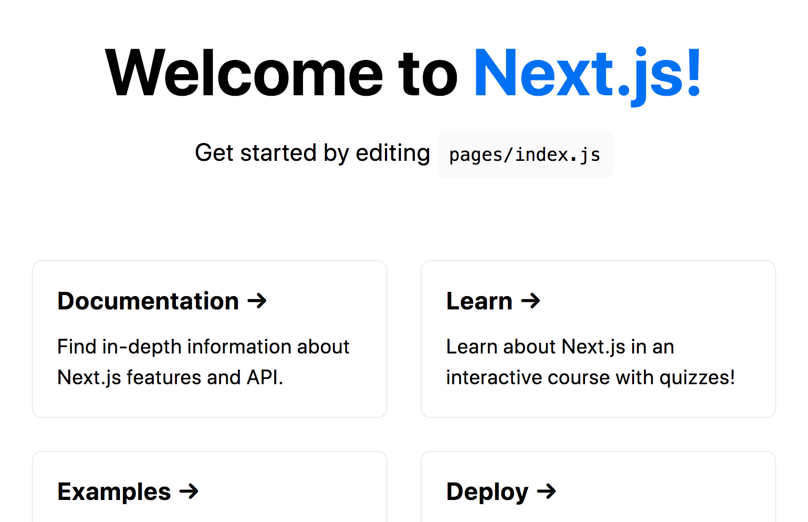

# Crear una aplicación Next.js

> [1](./1.md) &#5125; [2](./2.md) &#5125; [3](./3.md) &#5125; [4](./4.md)

## Bienvenido a Next.js

Debería ver una página como esta cuando acceda a [http://localhost:3000](http://localhost:3000). Esta es la página de la plantilla de inicio que muestra información útil sobre Next.js.

**Hay ayuda disponible:** si te quedas atascado, puedes comunicarte con la comunidad en [Discusiones de GitHub](https://github.com/vercel/next.js/discussions).

[Próximo &#707;](./4.md)
