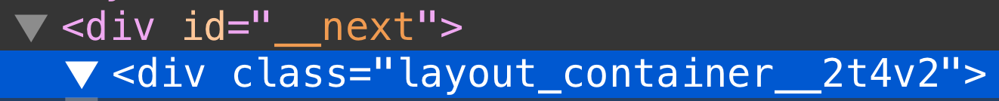

# Assets, metadatos y CSS

> [1](./1.md) &#5125; [2](./2.md) &#5125; [3](./3.md) &#5125; [4](./4.md) &#5125; [5](./5.md) &#5125; [6](./6.md) &#5125; [7](./7.md) &#5125; [8](./8.md) &#5125; [9](./9.md)

## Componente de diseño

Primero, creemos un componente de diseño que se compartirá en todas las páginas.

- Cree un directorio de nivel superior llamado `components`.
- Dentro `components`, crea un archivo llamado `layout.js` con el siguiente contenido:

```jsx
export default function Layout({ children }) {
  return <div>{children}</div>;
}
```

Luego, abra `pages/posts/first-post.js`, agregue una importación para el componente `Layout` y conviértalo en el componente más externo:

```jsx
import Head from "next/head";
import Link from "next/link";
import Layout from "../../components/layout";

export default function FirstPost() {
  return (
    <Layout>
      <Head>
        <title>First Post</title>
      </Head>
      <h1>First Post</h1>
      <h2>
        <Link href="/">
          <a>Back to home</a>
        </Link>
      </h2>
    </Layout>
  );
}
```

## Añadiendo CSS

Ahora, agreguemos algunos estilos al componente `Layout`. Para hacerlo, usaremos [módulos CSS](https://nextjs.org/docs/basic-features/built-in-css-support#adding-component-level-css), que le permiten importar archivos CSS en un componente React.

Cree un archivo llamado `components/layout.module.css` con el siguiente contenido:

```css
.container {
  max-width: 36rem;
  padding: 0 1rem;
  margin: 3rem auto 6rem;
}
```

> **Importante:** para utilizar [módulos CSS](https://nextjs.org/docs/basic-features/built-in-css-support#adding-component-level-css), el nombre del archivo CSS debe terminar en `.module.css`.

Para usar esta clase `container` en el interior de `components/layout.js`, debe:

- Importe el archivo CSS y asígnele un nombre, como `styles`
- Utilizar `styles.container` como `className`

Abra `components/layout.js` y reemplace su contenido con lo siguiente:

```jsx
import styles from "./layout.module.css";

export default function Layout({ children }) {
  return <div className={styles.container}>{children}</div>;
}
```

Si va a <http://localhost:3000/posts/first-post> ahora, debería ver que el texto ahora está dentro de un contenedor centrado:


## Genera automáticamente nombres de clase únicos

Ahora, si echas un vistazo al HTML en las herramientas de desarrollo de tu navegador, notarás que el `div` renderizado por el componente `Layout` tiene un nombre de clase que se parece a `layout_container__...`:



Esto es lo que hacen los [módulos CSS](https://nextjs.org/docs/basic-features/built-in-css-support#adding-component-level-css): genera automáticamente nombres de clase únicos . Siempre que use módulos CSS, no tiene que preocuparse por las colisiones de nombres de clases.

Además, la función de división de código de Next.js también funciona en [módulos CSS](https://nextjs.org/docs/basic-features/built-in-css-support#adding-component-level-css). Garantiza que se cargue la cantidad mínima de CSS para cada página. Esto da como resultado tamaños de paquete más pequeños.

[Los módulos CSS](https://nextjs.org/docs/basic-features/built-in-css-support#adding-component-level-css) se extraen de los paquetes de JavaScript en el momento de la compilación y generan archivos `.css` que Next.js. carga automáticamente.

[Próximo &#707;](./7.md)
