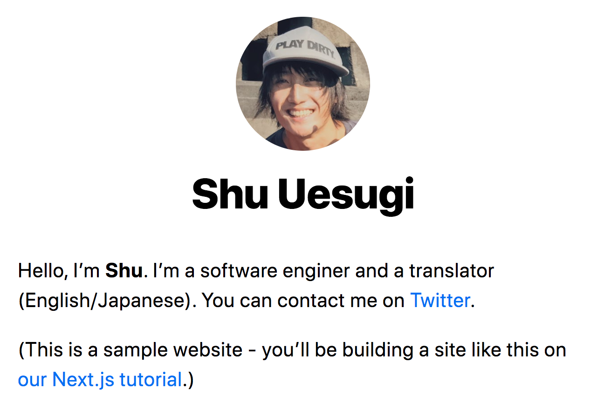

# Assets, metadatos y CSS

> [1](./1.md) &#5125; [2](./2.md) &#5125; [3](./3.md) &#5125; [4](./4.md) &#5125; [5](./5.md) &#5125; [6](./6.md) &#5125; [7](./7.md) &#5125; [8](./8.md) &#5125; [9](./9.md)

## Pulido del diseño

Hasta ahora, solo hemos agregado un código mínimo de React y CSS solo para ilustrar conceptos como los [módulos CSS](https://nextjs.org/docs/basic-features/built-in-css-support#adding-component-level-css). Antes de pasar a la siguiente lección sobre [la obtención de datos](https://nextjs.org/docs/basic-features/data-fetching), puliremos el estilo y el código de nuestra página.

### Actualizar `components/layout.module.css`

Primero, abra `components/layout.module.css` y reemplace su contenido con los siguientes estilos más pulidos para el diseño y la imagen de perfil:

```css
.container {
  max-width: 36rem;
  padding: 0 1rem;
  margin: 3rem auto 6rem;
}

.header {
  display: flex;
  flex-direction: column;
  align-items: center;
}

.backToHome {
  margin: 3rem 0 0;
}
```

### Crear `styles/utils.module.css`

En segundo lugar, creemos un conjunto de clases CSS de utilidad para tipografía y otras que serán útiles en múltiples componentes.

Agreguemos un nuevo archivo CSS llamado `styles/utils.module.css` con el siguiente contenido:

```css
.heading2Xl {
  font-size: 2.5rem;
  line-height: 1.2;
  font-weight: 800;
  letter-spacing: -0.05rem;
  margin: 1rem 0;
}

.headingXl {
  font-size: 2rem;
  line-height: 1.3;
  font-weight: 800;
  letter-spacing: -0.05rem;
  margin: 1rem 0;
}

.headingLg {
  font-size: 1.5rem;
  line-height: 1.4;
  margin: 1rem 0;
}

.headingMd {
  font-size: 1.2rem;
  line-height: 1.5;
}

.borderCircle {
  border-radius: 9999px;
}

.colorInherit {
  color: inherit;
}

.padding1px {
  padding-top: 1px;
}

.list {
  list-style: none;
  padding: 0;
  margin: 0;
}

.listItem {
  margin: 0 0 1.25rem;
}

.lightText {
  color: #666;
}
```

### Actualizar `components/layout.js`

En tercer lugar, abra `components/layout.js` y reemplace su contenido con el siguiente código, **cambiando** `Your Name` a un nombre real:

```jsx
import Head from "next/head";
import Image from "next/image";
import styles from "./layout.module.css";
import utilStyles from "../styles/utils.module.css";
import Link from "next/link";

const name = "Your Name";
export const siteTitle = "Next.js Sample Website";

export default function Layout({ children, home }) {
  return (
    <div className={styles.container}>
      <Head>
        <link rel="icon" href="/favicon.ico" />
        <meta
          name="description"
          content="Learn how to build a personal website using Next.js"
        />
        <meta
          property="og:image"
          content={`https://og-image.vercel.app/${encodeURI(
            siteTitle
          )}.png?theme=light&md=0&fontSize=75px&images=https%3A%2F%2Fassets.vercel.com%2Fimage%2Fupload%2Ffront%2Fassets%2Fdesign%2Fnextjs-black-logo.svg`}
        />
        <meta name="og:title" content={siteTitle} />
        <meta name="twitter:card" content="summary_large_image" />
      </Head>
      <header className={styles.header}>
        {home ? (
          <>
            <Image
              priority
              src="/images/profile.jpg"
              className={utilStyles.borderCircle}
              height={144}
              width={144}
              alt={name}
            />
            <h1 className={utilStyles.heading2Xl}>{name}</h1>
          </>
        ) : (
          <>
            <Link href="/">
              <a>
                <Image
                  priority
                  src="/images/profile.jpg"
                  className={utilStyles.borderCircle}
                  height={108}
                  width={108}
                  alt={name}
                />
              </a>
            </Link>
            <h2 className={utilStyles.headingLg}>
              <Link href="/">
                <a className={utilStyles.colorInherit}>{name}</a>
              </Link>
            </h2>
          </>
        )}
      </header>
      <main>{children}</main>
      {!home && (
        <div className={styles.backToHome}>
          <Link href="/">
            <a>← Back to home</a>
          </Link>
        </div>
      )}
    </div>
  );
}
```

Estas son las novedades:

- [`meta`etiquetas](https://en.wikipedia.org/wiki/Meta_element) (como `og:image`), que se utilizan para describir el contenido de una página
- Prop booleano `home` que ajustará el tamaño del título y la imagen.
- Vínculo "Back to home" en la parte inferior si `home` es `false`
- Imágenes agregadas con `next/image`, que están precargadas con el atributo de [prioridad](https://nextjs.org/docs/api-reference/next/image#priority)

### Actualizar `pages/index.js`

Finalmente, actualice la página de inicio.

Abra `pages/index.js` y reemplace su contenido con:

```jsx
import Head from "next/head";
import Layout, { siteTitle } from "../components/layout";
import utilStyles from "../styles/utils.module.css";

export default function Home() {
  return (
    <Layout home>
      <Head>
        <title>{siteTitle}</title>
      </Head>
      <section className={utilStyles.headingMd}>
        <p>[Your Self Introduction]</p>
        <p>
          (This is a sample website - you’ll be building a site like this on{" "}
          <a href="https://nextjs.org/learn">our Next.js tutorial</a>.)
        </p>
      </section>
    </Layout>
  );
}
```

Luego reemplace `[Your Self Introduction]` con su propia presentación. Aquí tienes un ejemplo con el perfil del autor:



¡Eso es! Ahora tenemos el código de pulido del diseño en su lugar para pasar a nuestras lecciones de obtención de datos.

Antes de concluir esta lección, hablemos de algunas técnicas útiles relacionadas con la compatibilidad con CSS de Next.js en la página siguiente.

[Próximo &#707;](./9.md)
