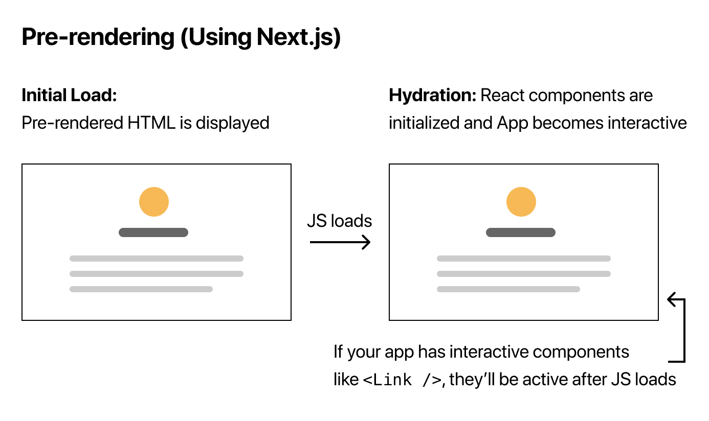

# Pre-renderizado y obtención de datos

> [1](./1.md) &#5125; [2](./2.md) &#5125; [3](./3.md) &#5125; [4](./4.md) &#5125; [5](./5.md) &#5125; [6](./6.md) &#5125; [7](./7.md) &#5125; [8](./8.md) &#5125; [9](./9.md)

## Pre-renderizado

Antes de hablar sobre [la obtención de datos](https://nextjs.org/docs/basic-features/data-fetching), hablemos de uno de los conceptos más importantes de Next.js: [**el pre-renderizado**](https://nextjs.org/docs/basic-features/pages#pre-rendering).

De forma predeterminada, Next.js pre-renderiza cada página. Esto significa que Next.js genera HTML para cada página por adelantado, en lugar de hacerlo todo con JavaScript del lado del cliente. El renderizado previo puede resultar en un mejor rendimiento y [SEO](https://en.wikipedia.org/wiki/Search_engine_optimization).

Cada HTML generado está asociado con un código JavaScript mínimo necesario para esa página. Cuando el navegador carga una página, su código JavaScript se ejecuta y hace que la página sea completamente interactiva. (Este proceso se llama **hidratación**).

### Compruebe que se esté realizando el pre-renderizado

Puede comprobar que se está realizando el pre-renderizado siguiendo los siguientes pasos:

- Deshabilite JavaScript en su navegador ([aquí esta cómo en Chrome](https://developers.google.com/web/tools/chrome-devtools/javascript/disable)) e…
- [Intente acceder a esta página](https://next-learn-starter.vercel.app/) (el resultado final de este tutorial).

Debería ver que su aplicación se renderiza sin JavaScript. Esto se debe a que Next.js ha pre-renderizado la aplicación en HTML estático, lo que le permite ver la interfaz de usuario de la aplicación sin ejecutar JavaScript.

> **Nota:** También puede probar los pasos anteriores en `localhost`, pero CSS no se cargará si deshabilita JavaScript.

Si su aplicación es una aplicación React.js simple (sin Next.js), no hay [pre-renderizado](https://nextjs.org/docs/basic-features/pages#pre-rendering), por lo que no podrá ver la aplicación si deshabilita JavaScript. Por ejemplo:

- Habilite JavaScript en su navegador y [consulte esta página](https://create-react-app.now-examples.vercel.app/). Esta es una aplicación simple de React.js construida con [Create React App](https://create-react-app.dev/).
- Ahora, desactive JavaScript y acceda a [la misma página](https://create-react-app.now-examples.vercel.app/) nuevamente.
- Ya no verá la aplicación; en su lugar, dirá "Necesita habilitar JavaScript para ejecutar esta aplicación". Esto se debe a que la aplicación no se pre-renderiza en HTML estático.

### Resumen: pre-renderizado frente a sin pre-renderizado

Aquí hay un resumen gráfico rápido:

A continuación, hablemos de dos formas de pre-renderizado en Next.js.

[Próximo &#707;](./4.md)
