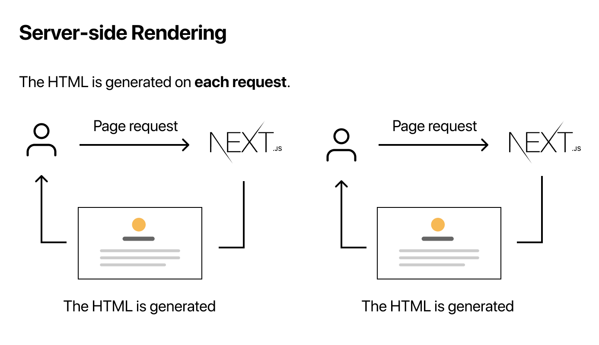

# Pre-renderizado y obtención de datos

> [1](./1.md) &#5125; [2](./2.md) &#5125; [3](./3.md) &#5125; [4](./4.md) &#5125; [5](./5.md) &#5125; [6](./6.md) &#5125; [7](./7.md) &#5125; [8](./8.md) &#5125; [9](./9.md)

### Dos formas de pre-renderizado

Next.js tiene dos formas de pre-renderizado: [**generación estática**](https://nextjs.org/docs/basic-features/pages#static-generation-recommended) y [**renderizado del lado del servidor**](https://nextjs.org/docs/basic-features/pages#server-side-rendering). La diferencia está en **cuando** genera el HTML para una página.

- [**Static Generation**](https://nextjs.org/docs/basic-features/pages#static-generation-recommended) es el método de pre-renderizado que genera el HTML en el **momento de la compilación**. El HTML pre-renderizado se reutiliza en cada solicitud.
- [**El renderizado del lado del servidor**](https://nextjs.org/docs/basic-features/pages#server-side-rendering) es el método de pre-renderizado que genera el HTML en **cada solicitud**.

> En el modo de desarrollo (cuando ejecuta `npm run dev` o `yarn dev`), todas las páginas se [pre-renderizan](https://nextjs.org/docs/basic-features/pages#pre-rendering) en cada solicitud, incluso para las páginas que usan [Static Generation](https://nextjs.org/docs/basic-features/pages#static-generation-recommended).

### Base por página

Es importante destacar que Next.js le permite **elegir** qué forma de pre-renderizado usar para cada página. Puede crear una aplicación Next.js "híbrida" utilizando la [generación estática](https://nextjs.org/docs/basic-features/pages#static-generation-recommended) para la mayoría de las páginas y el [renderizado del lado del servidor](https://nextjs.org/docs/basic-features/pages#server-side-rendering) para otras.

### Cuándo utilizar la [generación estática](https://nextjs.org/docs/basic-features/pages#static-generation-recommended) frente [al renderizado del lado del servidor](https://nextjs.org/docs/basic-features/pages#server-side-rendering)

Recomendamos usar [**Static Generation**](https://nextjs.org/docs/basic-features/pages#static-generation-recommended) (con y sin datos) siempre que sea posible porque su página se puede construir una vez y ser servida por CDN, lo que lo hace mucho más rápido que tener un servidor que renderice la página en cada solicitud.

Puede utilizar [Static Generation](https://nextjs.org/docs/basic-features/pages#static-generation-recommended) para muchos tipos de páginas, que incluyen:

- Páginas de marketing
- Publicaciones de blog
- Listados de productos de comercio electrónico
- Ayuda y documentación

Debería preguntarse: "¿Puedo renderizar previamente esta página **antes** de la solicitud de un usuario?" Si la respuesta es sí, entonces debe elegir [Generación estática](https://nextjs.org/docs/basic-features/pages#static-generation-recommended).

Por otro lado, [Static Generation](https://nextjs.org/docs/basic-features/pages#static-generation-recommended) **no** es una buena idea si no puede pre-renderizar una página antes de la solicitud de un usuario. Tal vez su página muestre datos actualizados con frecuencia y el contenido de la página cambie con cada solicitud.

En ese caso, puede utilizar el [**renderizado del lado del servidor**](https://nextjs.org/docs/basic-features/pages#server-side-rendering). Será más lento, pero la página renderizada previamente siempre estará actualizada. O puede omitir el pre-renderizado y utilizar JavaScript del lado del cliente para completar los datos que se actualizan con frecuencia.

### Nos centraremos en la generación estática

En esta lección, nos centraremos en la [generación estática](https://nextjs.org/docs/basic-features/pages#static-generation-recommended). En la página siguiente, hablaremos sobre la [generación estática](https://nextjs.org/docs/basic-features/pages#static-generation-recommended) **con y sin datos**.

[Próximo &#707;](./5.md)
