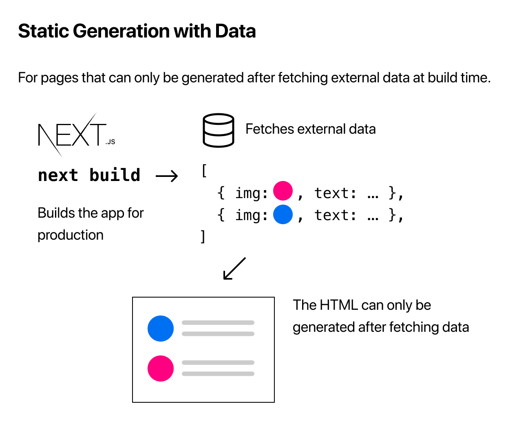

# Pre-renderizado y obtención de datos

> [1](./1.md) &#5125; [2](./2.md) &#5125; [3](./3.md) &#5125; [4](./4.md) &#5125; [5](./5.md) &#5125; [6](./6.md) &#5125; [7](./7.md) &#5125; [8](./8.md) &#5125; [9](./9.md)

### Generación estática con y sin datos

[La generación estática](https://nextjs.org/docs/basic-features/pages#static-generation-recommended) se puede realizar con y sin datos.

Hasta ahora, todas las páginas que hemos creado no requieren la obtención de datos externos. Esas páginas se generarán automáticamente de forma estática cuando la aplicación se cree para producción.


Sin embargo, para algunas páginas, es posible que no pueda procesar el HTML sin antes obtener algunos datos externos. Tal vez necesite acceder al sistema de archivos, obtener una API externa o consultar su base de datos en el momento de la compilación. Next.js admite este caso: [generación estática **con datos**](https://nextjs.org/docs/basic-features/pages#static-generation-with-data), listos para usar.



### Generación estática con datos usando `getStaticProps`

¿Como funciona? Bueno, en Next.js, cuando exporta un componente de página, también puede exportar una función `async` llamada [`getStaticProps`](https://nextjs.org/docs/basic-features/data-fetching#getstaticprops-static-generation). Si hace esto, entonces:

- [`getStaticProps`](https://nextjs.org/docs/basic-features/data-fetching#getstaticprops-static-generation) se ejecuta en el momento de la compilación en producción y...
- Dentro de la función, puede obtener datos externos y enviarlos como props a la página.

```jsx
export default function Home(props) { ... }

export async function getStaticProps() {
  // Get external data from the file system, API, DB, etc.
  const data = ...

  // The value of the `props` key will be
  //  passed to the `Home` component
  return {
    props: ...
  }
}
```

Básicamente, [`getStaticProps`](https://nextjs.org/docs/basic-features/data-fetching#getstaticprops-static-generation) le permite decirle a Next.js: "Oye, esta página tiene algunas dependencias de datos, así que cuando pre-renderices esta página en el momento de la compilación, asegúrate de resolverlas primero".

> **Nota:** En el modo de desarrollo, [`getStaticProps`](https://nextjs.org/docs/basic-features/data-fetching#getstaticprops-static-generation) se ejecuta en cada solicitud.

### Vamos a usar `getStaticProps`

Es más fácil aprender haciéndolo, así que a partir de la página siguiente, usaremos [`getStaticProps`](https://nextjs.org/docs/basic-features/data-fetching#getstaticprops-static-generation) para implementar nuestro blog.

[Próximo &#707;](./6.md)
