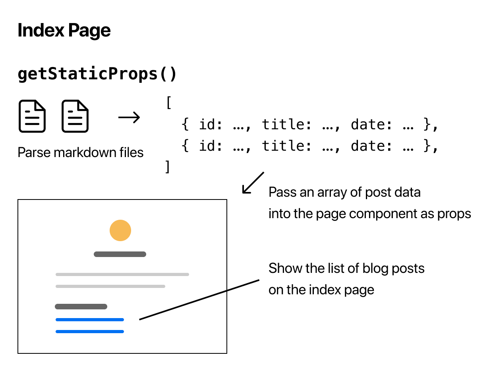

# Pre-renderizado y obtención de datos

> [1](./1.md) &#5125; [2](./2.md) &#5125; [3](./3.md) &#5125; [4](./4.md) &#5125; [5](./5.md) &#5125; [6](./6.md) &#5125; [7](./7.md) &#5125; [8](./8.md) &#5125; [9](./9.md)

## Implementar getStaticProps

Primero, instale [gray-matter](https://github.com/jonschlinkert/gray-matter) que nos permite analizar los metadatos en cada archivo de markdown.

```sh
npm install gray-matter
```

A continuación, crearemos una biblioteca simple para obtener datos del sistema de archivos.

- Cree un directorio de nivel superior llamado `lib`, y...
- Dentro de `lib`, crea un archivo llamado `posts.js` con el siguiente contenido:

```jsx
import fs from "fs";
import path from "path";
import matter from "gray-matter";

const postsDirectory = path.join(process.cwd(), "posts");

export function getSortedPostsData() {
  // Get file names under /posts
  const fileNames = fs.readdirSync(postsDirectory);
  const allPostsData = fileNames.map((fileName) => {
    // Remove ".md" from file name to get id
    const id = fileName.replace(/\.md$/, "");

    // Read markdown file as string
    const fullPath = path.join(postsDirectory, fileName);
    const fileContents = fs.readFileSync(fullPath, "utf8");

    // Use gray-matter to parse the post metadata section
    const matterResult = matter(fileContents);

    // Combine the data with the id
    return {
      id,
      ...matterResult.data,
    };
  });
  // Sort posts by date
  return allPostsData.sort((a, b) => {
    if (a.date < b.date) {
      return 1;
    } else {
      return -1;
    }
  });
}
```

Ahora, tenemos que añadir una importación de `getSortedPostsData` y llamarlo en el interior de [`getStaticProps`](https://nextjs.org/docs/basic-features/data-fetching#getstaticprops-static-generation) en `pages/index.js`.

Abra `pages/index.js` en su editor y agregue el siguiente código encima del componente `Home` exportado:

```jsx
import { getSortedPostsData } from "../lib/posts";

export async function getStaticProps() {
  const allPostsData = getSortedPostsData();
  return {
    props: {
      allPostsData,
    },
  };
}
```

Al retornar `allPostsData` dentro del objeto `props` en `getStaticProps`, las publicaciones del blog se pasarán al componente `Home` como un prop. Ahora puede acceder a las publicaciones del blog así:

```jsx
export default function Home ({ allPostsData }) { ... }
```

Para mostrar las publicaciones del blog, actualice el componente `Home` para agregar otra etiqueta `<section>` con los datos debajo de la sección con su propia presentación. No olvide cambiar también los props de `()` a `({ allPostsData })`:

```jsx
export default function Home({ allPostsData }) {
  return (
    <Layout home>
      {/* Keep the existing code here */}

      {/* Add this <section> tag below the existing <section> tag */}
      <section className={`${utilStyles.headingMd} ${utilStyles.padding1px}`}>
        <h2 className={utilStyles.headingLg}>Blog</h2>
        <ul className={utilStyles.list}>
          {allPostsData.map(({ id, date, title }) => (
            <li className={utilStyles.listItem} key={id}>
              {title}
              <br />
              {id}
              <br />
              {date}
            </li>
          ))}
        </ul>
      </section>
    </Layout>
  );
}
```

Ahora debería ver los datos del blog si accede a <http://localhost:3000>.


¡Felicidades! Hemos obtenido con éxito datos externos (del sistema de archivos) y hemos pre-renderizado la página index con estos datos.



Hablemos de algunos consejos para usar [`getStaticProps`](https://nextjs.org/docs/basic-features/data-fetching#getstaticprops-static-generation) en la página siguiente.

[Próximo &#707;](./8.md)
