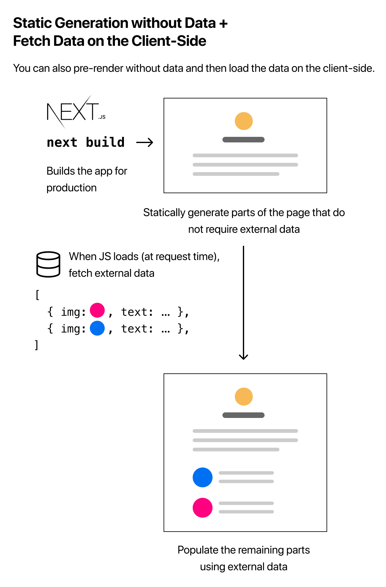

# Pre-renderizado y obtención de datos

> [1](./1.md) &#5125; [2](./2.md) &#5125; [3](./3.md) &#5125; [4](./4.md) &#5125; [5](./5.md) &#5125; [6](./6.md) &#5125; [7](./7.md) &#5125; [8](./8.md) &#5125; [9](./9.md)

## Obtención de datos en el momento de la solicitud

Si necesita obtener datos en el **momento de la solicitud** en lugar de en el momento de la compilación, puede probar el [**renderizado del lado del servidor**](https://nextjs.org/docs/basic-features/pages#server-side-rendering):


Para utilizar el [renderizado del lado del servidor](https://nextjs.org/docs/basic-features/pages#server-side-rendering), debe exportar en [`getServerSideProps`](https://nextjs.org/docs/basic-features/data-fetching#getserversideprops-server-side-rendering) en lugar de [`getStaticProps`](https://nextjs.org/docs/basic-features/data-fetching#getstaticprops-static-generation) desde su página.

### Utilizando `getServerSideProps`

Aquí está el código de inicio para [`getServerSideProps`](https://nextjs.org/docs/basic-features/data-fetching#getserversideprops-server-side-rendering). No es necesario para nuestro ejemplo de blog, por lo que no lo implementaremos.

```jsx
export async function getServerSideProps(context) {
  return {
    props: {
      // props for your component
    },
  };
}
```

Debido a que [`getServerSideProps`](https://nextjs.org/docs/basic-features/data-fetching#getserversideprops-server-side-rendering) se llama en el momento de la solicitud, su parámetro (`context`) contiene parámetros específicos de la solicitud.

Solo debe usarlo [`getServerSideProps`](https://nextjs.org/docs/basic-features/data-fetching#getserversideprops-server-side-rendering) si necesita pre-renderizar una página cuyos datos deben obtenerse en el momento de la solicitud. El tiempo hasta el primer byte ([TTFB](https://web.dev/time-to-first-byte/)) será más lento que [`getStaticProps`](https://nextjs.org/docs/basic-features/data-fetching#getstaticprops-static-generation) porque el servidor debe calcular el resultado en cada solicitud, y un [CDN](https://vercel.com/docs/edge-network/overview) no puede almacenar en caché el resultado sin una configuración adicional.

### Renderizado del lado del cliente

Si **no** necesita renderizar previamente los datos, también puede utilizar la siguiente estrategia (denominada [**renderizado del lado del cliente**](https://nextjs.org/docs/basic-features/data-fetching#fetching-data-on-the-client-side)):

- Genere (pre-renderice) de forma estática partes de la página que no requieran datos externos.
- Cuando se cargue la página, obtenga datos externos del cliente utilizando JavaScript y complete las partes restantes.



Este enfoque funciona bien para las páginas del dashboard del usuario, por ejemplo. Debido a que un dashboard es una página privada específica del usuario, el SEO no es relevante y la página no necesita ser [pre-renderizada](https://nextjs.org/docs/basic-features/pages#pre-rendering). Los datos se actualizan con frecuencia, lo que requiere la obtención de datos en el momento de la solicitud.

### SWR

El equipo detrás de Next.js ha creado un hook de React para la búsqueda de datos llamado [**SWR**](https://swr.vercel.app/). Lo recomendamos encarecidamente si está obteniendo datos del lado del cliente. Maneja el almacenamiento en caché, la revalidación, el seguimiento de enfoque, la recuperación en el intervalo y más. No cubriremos los detalles aquí, pero aquí hay un ejemplo de uso:

```jsx
import useSWR from "swr";

function Profile() {
  const { data, error } = useSWR("/api/user", fetch);

  if (error) return <div>failed to load</div>;
  if (!data) return <div>loading...</div>;
  return <div>hello {data.name}!</div>;
}
```

Consulte la [documentación de SWR](https://swr.vercel.app/) para obtener más información.

### ¡Eso es!

En la siguiente lección, crearemos páginas para cada publicación de blog utilizando [**rutas dinámicas**](https://nextjs.org/docs/routing/dynamic-routes).

> Nuevamente, puede obtener información detallada sobre [`getStaticProps`](https://nextjs.org/docs/basic-features/data-fetching#getstaticprops-static-generation) y [`getServerSideProps`](https://nextjs.org/docs/basic-features/data-fetching#getserversideprops-server-side-rendering) en la [documentación de obtención de datos](https://nextjs.org/docs/basic-features/data-fetching).

[Siguiente lección](../5/1.md)
