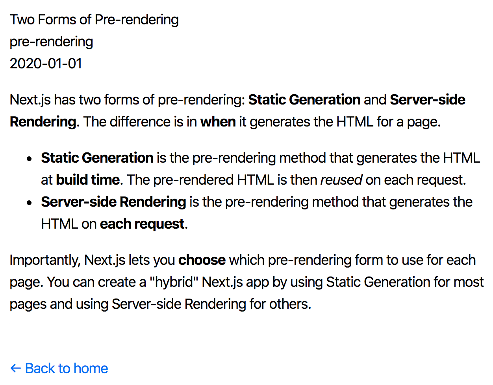

# Rutas dinámicas

> [1](./1.md) &#5125; [2](./2.md) &#5125; [3](./3.md) &#5125; [4](./4.md) &#5125; [5](./5.md) &#5125; [6](./6.md) &#5125; [7](./7.md) &#5125; [8](./8.md) &#5125; [9](./9.md)

## Render Markdown

Para renderizar contenido de markdown, usaremos la biblioteca `remark`. Primero, instalémoslo:

```sh
npm install remark remark-html
```

Luego, abra l`ib/posts.js` y agregue las siguientes importaciones en la parte superior del archivo:

```jsx
import remark from "remark";
import html from "remark-html";
```

Y actualice la función `getPostData()` en el mismo archivo de la siguiente manera para usar `remark`:

```jsx
export async function getPostData(id) {
  const fullPath = path.join(postsDirectory, `${id}.md`);
  const fileContents = fs.readFileSync(fullPath, "utf8");

  // Use gray-matter to parse the post metadata section
  const matterResult = matter(fileContents);

  // Use remark to convert markdown into HTML string
  const processedContent = await remark()
    .use(html)
    .process(matterResult.content);
  const contentHtml = processedContent.toString();

  // Combine the data with the id and contentHtml
  return {
    id,
    contentHtml,
    ...matterResult.data,
  };
}
```

> **Importante:** Agregamos la palabra clave **`async`** a getPostData porque necesitamos usar `await` para `remark`. `async`/`await` le permite obtener datos de forma [asincrónica](https://developer.mozilla.org/en-US/docs/Web/JavaScript/Reference/Statements/async_function).

Eso significa que necesitamos actualizar [`getStaticProps`](https://nextjs.org/docs/basic-features/data-fetching#getstaticprops-static-generation) en `pages/posts/[id].js` para usar `await` al llamar a `getPostData`:

```js
export async function getStaticProps({ params }) {
  // Add the "await" keyword like this:
  const postData = await getPostData(params.id);
  // ...
}
```

Finalmente, actualice el componente `Post` en `pages/posts/[id].js` para renderizar `contentHtml` usando [`dangerouslySetInnerHTML`](https://reactjs.org/docs/dom-elements.html#dangerouslysetinnerhtml):

```jsx
export default function Post({ postData }) {
  return (
    <Layout>
      {postData.title}
      <br />
      {postData.id}
      <br />
      {postData.date}
      <br />
      <div dangerouslySetInnerHTML={{ __html: postData.contentHtml }} />
    </Layout>
  );
}
```

Intente visitar estas páginas nuevamente:

- <http://localhost:3000/posts/ssg-ssr>
- <http://localhost:3000/posts/pre-rendering>

Ahora debería ver el contenido del blog:



¡Ya casi hemos terminado! A continuación, puliremos cada página.

[Próximo &#707;](./7.md)
