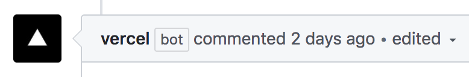

# Implementación de su aplicación Next.js

> [1](./1.md) &#5125; [2](./2.md) &#5125; [3](./3.md) &#5125; [4](./4.md) &#5125; [5](./5.md) &#5125; [6](./6.md) &#5125; [7](./7.md) &#5125;

## Next.js y Vercel

[Vercel](https://vercel.com/) está hecho por los creadores de Next.js y tiene soporte de primera clase para Next.js. Cuando implementa su aplicación Next.js en Vercel, ocurre lo siguiente de manera predeterminada:

- Las páginas que utilizan [Static Generation](https://nextjs.org/docs/basic-features/pages#static-generation-recommended) y activos (JS, CSS, imágenes, fuentes, etc.) se servirán automáticamente desde [Vercel Edge Network](https://vercel.com/docs/edge-network/overview), que es increíblemente rápido.
- Las páginas que utilizan el [renderizado del lado del servidor](https://nextjs.org/docs/basic-features/pages#server-side-rendering) y [las API Routes](https://nextjs.org/docs/api-routes/introduction) se convertirán automáticamente en funciones sin servidor aisladas . Esto permite que el renderizado de la página y las solicitudes de API se escalen infinitamente.

Vercel tiene muchas más funciones, como:

- **Dominios personalizados:** una vez implementado en Vercel , puede asignar un dominio personalizado a su aplicación Next.js. Eche un vistazo a [nuestra documentación](https://vercel.com/docs/custom-domains) aquí.
- **Variables de entorno:** también puede establecer variables de entorno en Vercel. Eche un vistazo a [nuestra documentación](https://vercel.com/docs/build-step#environment-variables) aquí. Luego puede [usar esas variables de entorno](https://nextjs.org/docs/basic-features/environment-variables#loading-environment-variables) en su aplicación Next.js.
- **HTTPS automático:** HTTPS está habilitado de forma predeterminada (incluidos los dominios personalizados) y no requiere configuración adicional. Renovamos automáticamente los certificados SSL.

Puede obtener más información sobre la plataforma en la [documentación de Vercel](https://vercel.com/docs).

### Vista previa de la implementación para cada push

> Los pasos a continuación son **opcionales**; puede probarlos o simplemente leerlos.

Después de implementar en Vercel, intente hacer lo siguiente si puede:

- Crea una nueva **rama** en tu aplicación.
- Realice algunos cambios y envíe a GitHub.
- Crea una nueva **pull request** ([página de ayuda de GitHub](https://help.github.com/en/github/collaborating-with-issues-and-pull-requests/creating-a-pull-request)).

Debería ver un comentario del `vercel` bot en la página de pull request.

Intente hacer clic en la URL de **vista previa** dentro de este comentario. Debería ver los cambios que acaba de realizar.

Cuando tiene una pull request abierta, Vercel crea automáticamente una **implementación de vista previa** para esa rama en cada **envío**. La URL de vista previa siempre apuntará a la última implementación de vista previa.

Puede compartir esta URL de vista previa con sus colaboradores y obtener comentarios de inmediato.

Si su implementación de vista previa se ve bien, **combínela con `main`** . Cuando hace esto, Vercel crea automáticamente una implementación de producción.

### Develop, Preview, Ship

Acabamos de pasar por el flujo de trabajo que llamamos **DPS**: **D** evelop, **P** review y **S** hip.

- **Develop:** escribimos código en Next.js y usamos el servidor de desarrollo Next.js en ejecución para aprovechar su función de recarga en caliente.
- **Preview:** enviamos cambios a una rama en GitHub y Vercel creó una implementación de vista previa que está disponible a través de una URL. Podemos compartir esta URL de vista previa con otros para recibir comentarios. Además de realizar revisiones de código , puede realizar vistas previas de la implementación .
- **Ship:** Hemos fusionado la pull request con `main` para enviar a producción.

Recomendamos encarecidamente utilizar este flujo de trabajo al desarrollar aplicaciones Next.js, ya que le ayudará a iterar en su aplicación más rápido.

[Próximo &#707;](./6.md)
